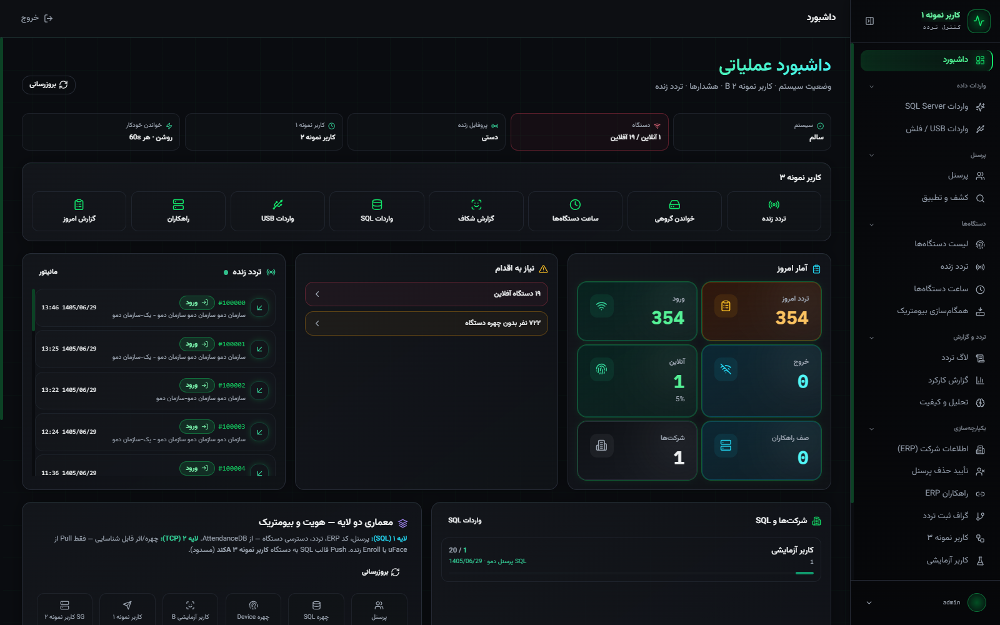
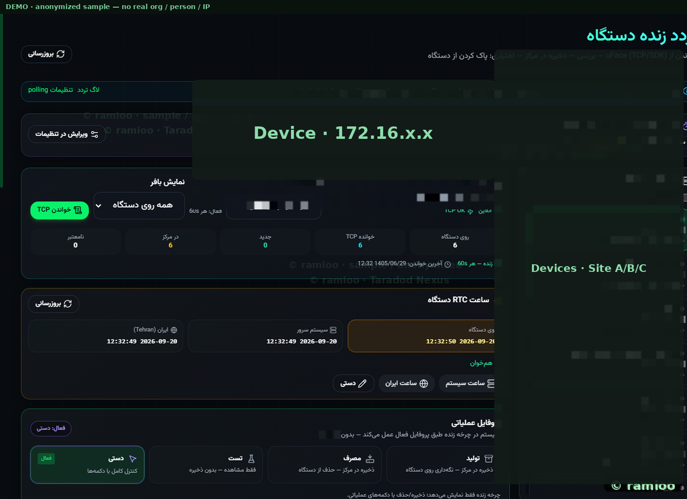
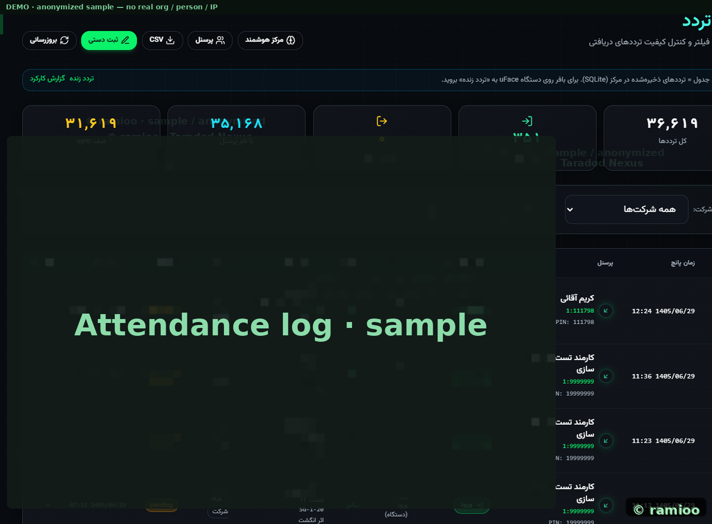
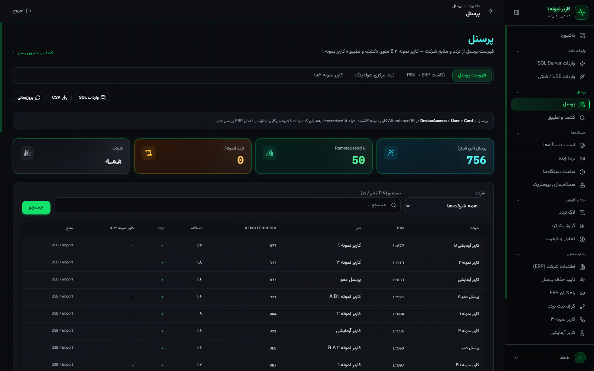
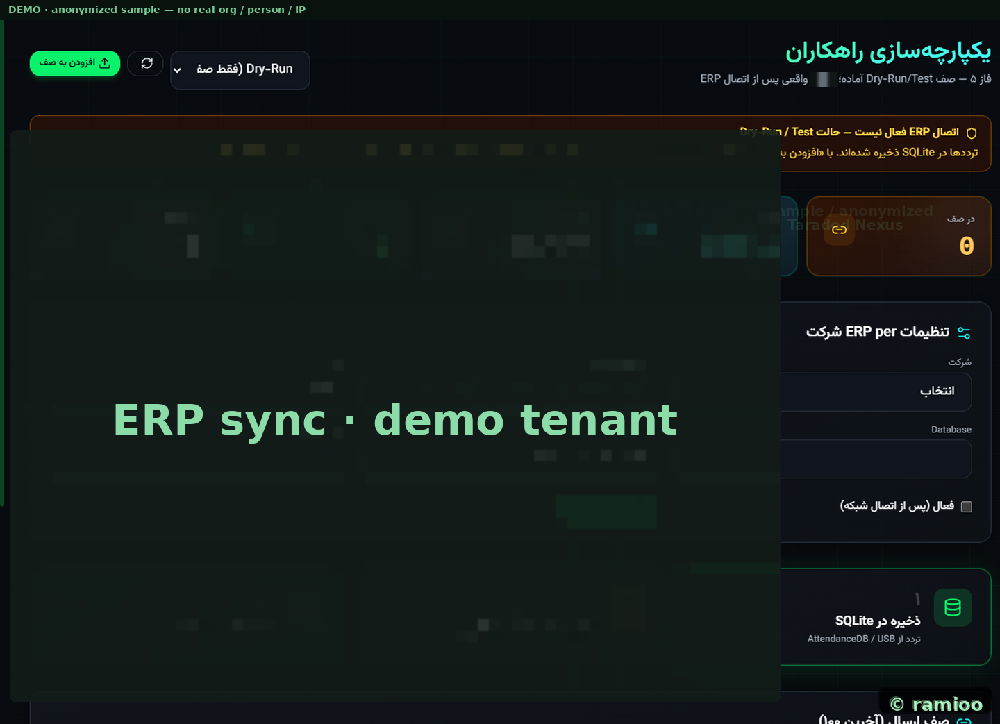
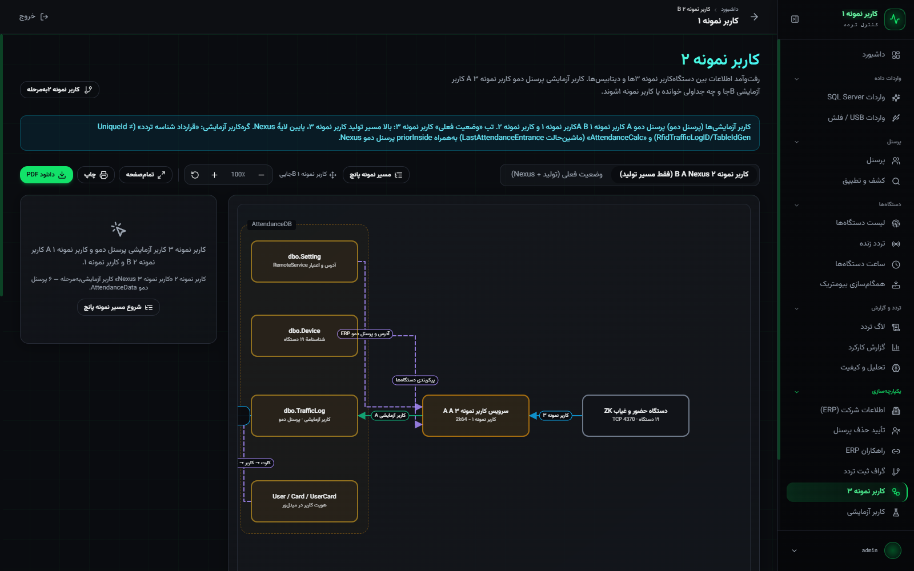
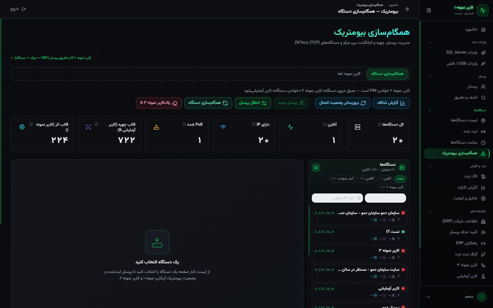

# Taradod Nexus

**Access Control · Biometrics · Rahkaran ERP** — public product catalog

  

  <a href="https://ramincsy.github.io/taradod-nexus-showcase/">https://ramincsy.github.io/taradod-nexus-showcase/</a>

  
  

> **Demo first:** open the **GitHub Pages** catalog for the full interactive lightbox. Screenshots are **anonymized** (no real people, orgs, or device IPs). Implementation stays private.

---

## Live catalog (GitHub Pages)

| | |
|:--|:--|
| **Open demo** | [ramincsy.github.io/taradod-nexus-showcase](https://ramincsy.github.io/taradod-nexus-showcase/) |
| What you get | Full-frame UI gallery with click‑to‑zoom |
| Stack window | Biometric devices → clean attendance → Rahkaran ERP |

---

## Preview

  

<b><a href="https://ramincsy.github.io/taradod-nexus-showcase/">Open the interactive catalog →</a></b>

| Live traffic | Attendance logs | Personnel |
|:---:|:---:|:---:|
|  |  |  |

| Rahkaran / ERP | Data flow | Biometrics |
|:---:|:---:|:---:|
|  |  |  |

---

## Surfaces in the catalog

| Area | What you see |
|------|----------------|
| Ops | Operational dashboard, live TCP traffic, attendance logs |
| People | Personnel hub, SQL Server import, attendance flow |
| Devices | Sites/stations, biometric sync |
| ERP | Rahkaran sync, data-flow tree, company hub |
| QA | Analytics / quality, settings, login |

---

### فارسی

این مخزن یک <b>کاتالوگ عمومی</b> از رابط سامانهٔ کنترل تردد Taradod Nexus است. برای دیدن دمو (گالری تعاملی و بزرگ‌نمایی تصاویر) به GitHub Pages بروید:

<a href="https://ramincsy.github.io/taradod-nexus-showcase/"><b>مشاهده کاتالوگ زنده Taradod Nexus</b></a>

اسکرین‌ها برای انتشار عمومی ناشناس‌سازی شده‌اند (بدون نام واقعی افراد/سازمان و بدون IP دستگاه). سورس و جزئیات پیاده‌سازی خصوصی می‌ماند.

---

**Contact:** [ramioo.com](https://www.ramioo.com) · [ramincsywork@gmail.com](mailto:ramincsywork@gmail.com) · [0914 666 50 68](tel:+989146665068)

© ramioo
